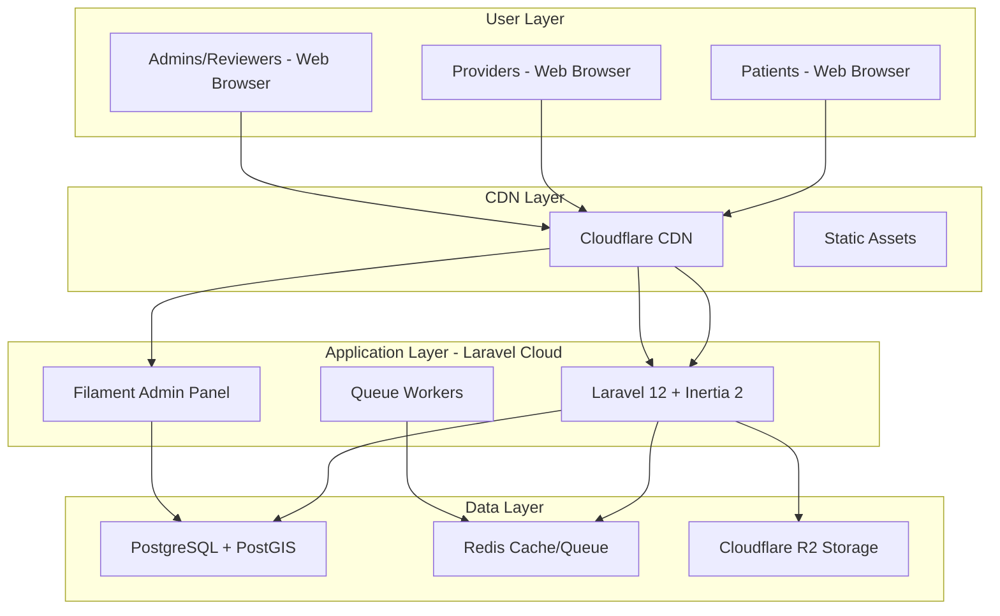
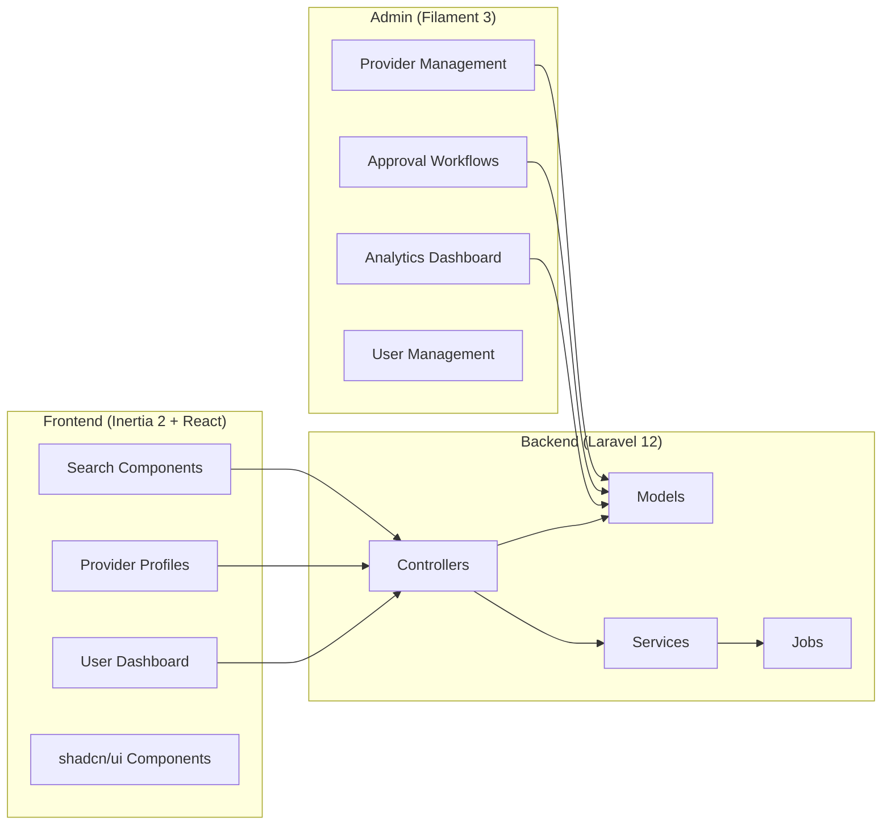

# The (M) Factor Provider Directory - Overview & Architecture

## Project Overview

A healthcare provider directory platform connecting menopause patients with appropriate providers, featuring approval workflows, multi-role access, comprehensive search capabilities, analytics tracking, and data security.

**Tech Stack**: Laravel 12 + Filament 3 + Inertia 2 + PostgreSQL + Cloudflare  
**Timeline**: 12 weeks (solo developer) - Extended to include advanced matching algorithm  
**Soft Launch Target**: January 1st

## Why Laravel 12 for Healthcare?

Laravel 12's release (February 24, 2025) brings significant advantages for healthcare applications:
- **New Starter Kits**: Save 20+ hours with pre-configured TypeScript, Inertia 2, and shadcn/ui
- **Minimal Breaking Changes**: Easy to maintain and update - critical for healthcare compliance
- **WorkOS Integration**: Optional enterprise SSO for large healthcare providers
- **Improved Performance**: Better handling of search-heavy applications
- **Long Support Cycle**: Security updates until February 2027

## System Architecture

### High-Level Architecture

### Component Architecture

## Frontend Architecture Options

### Laravel 12 Starter Kit Options

Laravel 12 introduces new starter kits that replace Breeze/Jetstream:

#### Option 1: Laravel + React/Vue Kit (Recommended)
- **Includes**: Inertia 2, TypeScript, shadcn/ui, Tailwind CSS
- **Authentication**: Built-in Laravel auth or WorkOS AuthKit
- **Pros**: Modern stack, TypeScript by default, beautiful UI components
- **Best for**: Your healthcare directory MVP

#### Option 2: Laravel + Livewire Kit
- **Includes**: Flux UI components, Laravel Volt, Tailwind CSS
- **Authentication**: Built-in Laravel auth or WorkOS AuthKit
- **Pros**: No JavaScript build step, server-side rendering
- **Best for**: Teams preferring PHP-only

#### Migration Note
You can switch between React and Vue after installation. See [Frontend Migration Commands](code-snippets.md#frontend-migration-commands) for details.

#### WorkOS AuthKit Benefits (Optional)
- **Free up to 1M monthly active users**
- **SSO Support**: Important for enterprise healthcare providers
- **Passkeys**: Modern passwordless authentication
- **Social Login**: Google, Microsoft, etc.

**Recommendation**: Start with React kit + built-in auth, add WorkOS later if needed for enterprise SSO

## Complete Tech Stack

### Backend Framework & Tools
- **[Laravel 12](https://laravel.com/)** - Released February 2025
- **[Filament 3](https://filamentphp.com/)** - Admin panel builder
- **[Laravel Orion](https://tailflow.github.io/laravel-orion-docs/)** - API generator
- **[PHP 8.4](https://www.php.net/)** - Latest PHP version
- **[Composer](https://getcomposer.org/)** - Dependency manager

### Frontend (Laravel 12 Starter Kit)
- **[Inertia 2](https://inertiajs.com/)** - Modern SPA framework
- **[React 18](https://react.dev/)** or **[Vue 3](https://vuejs.org/)** - UI framework
- **[TypeScript 5](https://www.typescriptlang.org/)** - Type safety by default
- **[shadcn/ui](https://ui.shadcn.com/)** - Beautiful components
- **[Tailwind CSS 3](https://tailwindcss.com/)** - Utility styling

### Database & Storage
- **[PostgreSQL 16](https://www.postgresql.org/)** - Latest version
- **[PostGIS 3.4](https://postgis.net/)** - Spatial queries
- **[Redis 7](https://redis.io/)** - Caching and queues
- **[Neon](https://neon.tech/)** - Development database only

### Development Tools
- **[Laravel Herd](https://herd.laravel.com/)** - Local development (latest)
- **[PHPStan](https://phpstan.org/)** - Static analysis
- **[Pest 2](https://pestphp.com/)** - Modern testing
- **[Laravel Pint](https://github.com/laravel/pint)** - Code formatting

## Why This Architecture?

1. **Laravel 12**: Latest features with minimal breaking changes
2. **Laravel Cloud**: Managed hosting eliminates DevOps complexity
3. **Cloudflare R2**: Cheaper than S3, integrated with Cloudflare
4. **PostgreSQL Only**: Simpler than multiple databases, handles analytics fine at MVP scale
5. **Inertia 2 + TypeScript**: Type-safe development with modern React/Vue
6. **No Meilisearch**: PostgreSQL full-text search is sufficient for MVP

## Laravel 12 Support Timeline

- **Release Date**: February 24, 2025
- **Bug Fixes Until**: August 13, 2026 (18 months)
- **Security Fixes Until**: February 24, 2027 (2 years)
- **PHP Support**: 8.2 - 8.4
- **Upgrade Path**: Minimal breaking changes from Laravel 11

This gives you excellent long-term stability for your healthcare platform. The minimal breaking changes philosophy means easier maintenance and updates throughout your application's lifecycle.