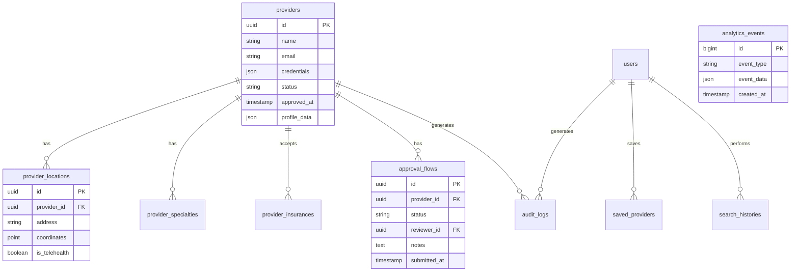
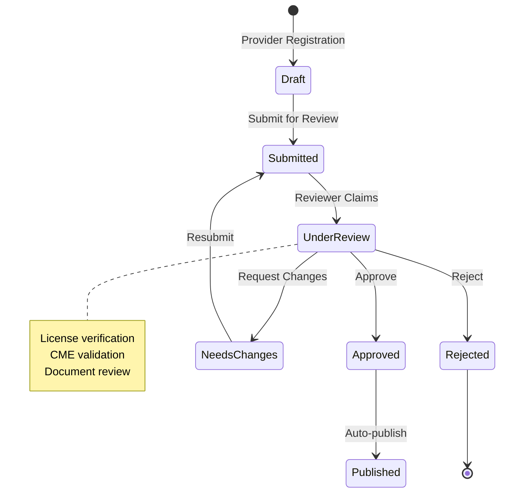
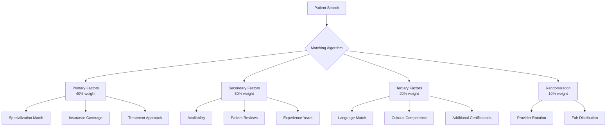
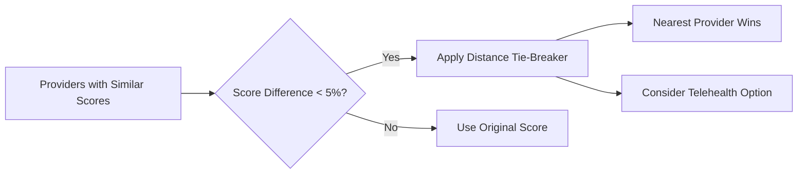
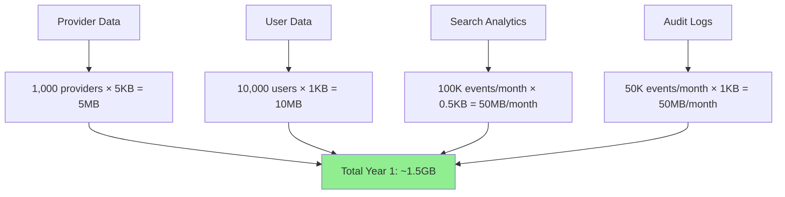

# The (M) Factor - Database Design & Matching Algorithm

## Database Schema Design

## Database Architecture Explained

### Why These Databases?

1. **PostgreSQL** (Primary Database)
   - Stores all application data
   - PostGIS extension for location-based searches
   - Full-text search capabilities
   - JSONB for flexible provider attributes

2. **Neon** (Development Only)
   - Free tier for development
   - Branch databases for testing features
   - Automatic backups
   - Laravel 12 has improved database connection handling
   - **Production**: Use Laravel Cloud's managed PostgreSQL

3. **Redis** (Caching & Queues)
   - Cache search results (faster response times)
   - Queue email notifications
   - Store temporary analytics events
   - Session management

## Provider Approval Workflow

## Provider Matching Algorithm

### Overview

The matching algorithm is designed to provide personalized provider recommendations for menopause patients while ensuring fair distribution and preventing the same providers from always appearing first. The algorithm considers multiple factors specific to menopause care and uses a sophisticated ranking system.

### Key Matching Factors

### Menopause-Specific Matching Criteria

#### 1. Specialization Matching (Primary Factor)
- **Menopause Specialist**: Highest priority
- **Gynecologist with Menopause Focus**: High priority
- **Endocrinologist**: Medium-high priority
- **Primary Care with Menopause Training**: Medium priority
- **Mental Health Specialist**: Context-dependent priority

#### 2. Treatment Philosophy Alignment
- **Hormone Therapy (HRT) Approach**:
  - Pro-HRT providers for patients seeking hormone therapy
  - Conservative HRT approach for cautious patients
  - Non-HRT alternatives for those avoiding hormones
- **Holistic vs. Traditional Medicine**:
  - Integrative medicine practitioners
  - Traditional medical approach
  - Combination approach

#### 3. Symptom-Specific Expertise
- **Hot Flashes & Night Sweats**: Providers with thermal symptom expertise
- **Mood & Mental Health**: Providers with psychological support training
- **Bone Health**: Providers focusing on osteoporosis prevention
- **Sexual Health**: Providers comfortable discussing intimate concerns
- **Sleep Disorders**: Providers with sleep medicine knowledge

### Ranking Algorithm Implementation

The matching algorithm uses a weighted scoring system to rank providers based on multiple factors. See [Provider Matching Service](code-snippets.md#provider-matching-service) for the implementation details.

### Provider Rotation & Fair Distribution

#### Rotation Algorithm
1. **Historical Appearance Tracking**: Track how often each provider appears in top results
2. **Rotation Score**: Decrease score for providers who appeared frequently recently
3. **Time-Based Decay**: Reset rotation penalties over time
4. **Minimum Visibility**: Ensure all approved providers get some visibility

#### Implementation Strategy
The rotation tracking system uses a dedicated table to monitor provider appearances and calculate penalties. See [Provider Rotation Tracking](code-snippets.md#provider-rotation-tracking) for the SQL implementation.

### Distance as Tie-Breaker

### A/B Testing Framework

#### Test Variations
1. **Control Group**: Current matching algorithm
2. **Variant A**: Increased weight on specialization
3. **Variant B**: Increased weight on patient reviews
4. **Variant C**: More aggressive rotation

#### Metrics to Track
- **Click-through Rate**: Which providers get clicked
- **Contact Rate**: Which providers get contacted
- **Patient Satisfaction**: Post-appointment surveys
- **Provider Distribution**: Fairness metrics
- **Return Rate**: Patients coming back to search

### Switch Provider Triggers

The same factors used for matching are monitored to suggest when patients might benefit from switching providers:

1. **Treatment Ineffectiveness**: No symptom improvement after 3-6 months
2. **Philosophy Mismatch**: Patient wants different treatment approach
3. **Insurance Changes**: Provider no longer in network
4. **Availability Issues**: Can't get timely appointments
5. **Location Changes**: Patient moves or wants closer provider
6. **Specialty Needs**: Symptoms require different expertise

### Performance Optimization

The matching query is optimized using Common Table Expressions (CTEs) to efficiently calculate scores and apply rotation penalties. See [Optimized Matching Query](code-snippets.md#optimized-matching-query) for the full SQL implementation.

### Caching Strategy for Performance

1. **Pre-compute Common Searches**: Cache results for common symptom combinations
2. **Location-Based Caching**: Cache providers by geographic regions
3. **Warm Cache**: Pre-load popular searches during off-peak hours
4. **Personalized Results**: Cache user-specific preferences

## Database Sizing Estimates

