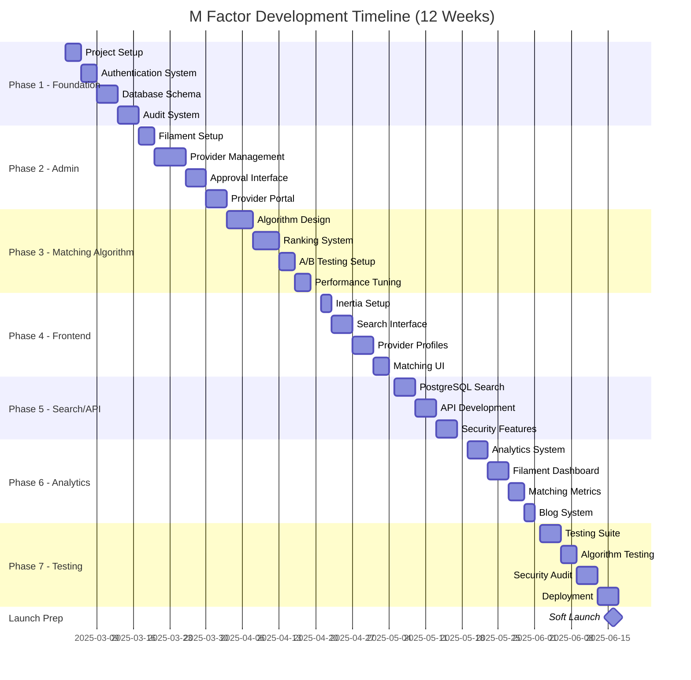
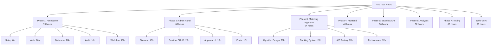

# The (M) Factor - Implementation Timeline & Milestones

## Structured Timeline & Milestones

## Detailed Work Breakdown Structure

## Sprint-Based Timeline (2-Week Sprints) - 12 Week Plan

### Sprint 1 (Weeks 1-2): Foundation ✅
**Goal**: Basic Laravel app with authentication and enhanced database schema

| Task | Hours | Status |
|------|-------|--------|
| Laravel 12 + Starter Kit Setup | 8 | |
| Multi-role Authentication | 10 | |
| Database Schema + Migrations | 20 | |
| Audit System Setup | 16 | |
| Basic Approval Workflow | 16 | |
| **Sprint Total** | **70** | |

**Deliverable**: Working Laravel app with user auth and comprehensive database

### Sprint 2 (Weeks 3-4): Admin Panel ✅
**Goal**: Complete admin interface with provider management

| Task | Hours | Status |
|------|-------|--------|
| Filament Setup + Customization | 10 | |
| Provider Resource Management | 26 | |
| Approval Workflow Interface | 16 | |
| Provider Self-Service Portal | 16 | |
| **Sprint Total** | **68** | |

**Deliverable**: Functional admin panel with approval system

### Sprint 3 (Weeks 5-6): Matching Algorithm ✅
**Goal**: Implement sophisticated provider matching system

| Task | Hours | Status |
|------|-------|--------|
| Algorithm Design & Architecture | 20 | |
| Ranking System Implementation | 20 | |
| A/B Testing Framework | 12 | |
| Performance Optimization | 12 | |
| **Sprint Total** | **64** | |

**Deliverable**: Working matching algorithm with rotation and fairness

### Sprint 4 (Weeks 7-8): Frontend & Search ✅
**Goal**: Patient-facing search interface with matching integration

| Task | Hours | Status |
|------|-------|--------|
| Inertia Setup | 4 | |
| Search Interface | 16 | |
| Provider Profiles | 16 | |
| Matching UI Integration | 12 | |
| Frontend Components | 20 | |
| API Development | 16 | |
| Security Features | 12 | |
| **Sprint Total** | **96** | |

**Deliverable**: Working search with intelligent matching

### Sprint 5 (Weeks 9-10): Analytics & Metrics ✅
**Goal**: Analytics system with matching algorithm metrics

| Task | Hours | Status |
|------|-------|--------|
| Analytics System | 16 | |
| Dashboard Creation | 16 | |
| Matching Algorithm Metrics | 12 | |
| Blog Setup | 8 | |
| **Sprint Total** | **52** | |

**Deliverable**: Complete analytics with algorithm performance tracking

### Sprint 6 (Weeks 11-12): Testing & Launch ✅
**Goal**: Comprehensive testing and deployment

| Task | Hours | Status |
|------|-------|--------|
| Testing Suite | 20 | |
| Algorithm Testing | 12 | |
| Security Audit | 16 | |
| Performance Testing | 8 | |
| Deployment | 16 | |
| **Sprint Total** | **72** | |

**Deliverable**: Production-ready application with tested matching algorithm

## Updated Time Estimates (12 Week Plan)

| Phase | Hours | Weeks |
|-------|-------|-------|
| Phase 1: Foundation | 70 | 1.75 |
| Phase 2: Admin Panel | 68 | 1.70 |
| Phase 3: Matching Algorithm | 64 | 1.60 |
| Phase 4: Frontend | 40 | 1.00 |
| Phase 5: Search & API | 56 | 1.40 |
| Phase 6: Analytics | 52 | 1.30 |
| Phase 7: Testing & Launch | 60 | 1.50 |
| **Subtotal** | **410** | **10.25** |
| **15% Buffer** | **70** | **1.75** |
| **Total** | **480** | **12.0** |

## Key Benefits of Extended Timeline

1. **Superior Matching Algorithm**: Patients get personalized provider recommendations
2. **Fair Provider Distribution**: Prevents monopolization by a few providers
3. **A/B Testing**: Data-driven optimization of matching criteria
4. **Better User Experience**: More relevant results lead to higher satisfaction
5. **Scalable Architecture**: Algorithm designed to handle growth
6. **Comprehensive Testing**: More time for algorithm validation

## Updated Task Breakdown

### Phase 1: Foundation & Infrastructure (Week 1-2) - 70 hours

#### 1.1 Project Setup - 8 hours
- Laravel 12 installation with React starter kit
- Laravel Cloud account setup
- PostgreSQL configuration
- Redis setup (automatic with Cloud)
- Git repository setup

#### 1.2 Authentication System - 10 hours
- Starter kit includes full authentication
- Multi-role setup (Provider, Patient, Reviewer, Admin)
- 2FA configuration (built-in)
- Social login setup (optional with WorkOS)

**Note**: Laravel Breeze and Jetstream are no longer updated. Laravel 12's new starter kits replace them with better defaults.

**Healthcare Authentication Strategy**:
- **MVP**: Use built-in Laravel auth (simpler, faster)
- **Growth**: Add WorkOS when enterprise providers need SSO
- **Benefits**: WorkOS free tier covers up to 1M monthly active users

#### 1.3 Core Database Schema - 20 hours
- Provider and related tables
- Approval workflow tables
- Audit trail structure
- Location data with PostGIS
- Analytics event tables
- Search optimization indexes
- Matching algorithm tables

#### 1.4 Audit & Compliance System - 16 hours
- Laravel Auditing setup
- HIPAA compliance logging
- Data retention policies
- Cloudflare R2 for document storage

#### 1.5 Approval Workflow Foundation - 16 hours
- Process Approval configuration
- Email notifications via Resend
- Workflow states
- Reviewer assignments

### Phase 2: Admin Panel & Provider Management (Week 3-4) - 68 hours

#### 2.1 Filament Admin Panel Setup - 10 hours
- Filament installation and configuration
- Custom theme setup
- Navigation structure
- Permission system

#### 2.2 Provider Resource Management - 26 hours
- CRUD operations for providers
- Profile editing interface
- Document upload system
- License verification interface

#### 2.3 Approval Workflow Interface - 16 hours
- Review queue dashboard
- Approval/rejection interface
- Notes and communication system
- Status tracking

#### 2.4 Provider Self-Service Portal - 16 hours
- Provider dashboard
- Profile management
- Document uploads
- Status tracking

### Phase 3: Matching Algorithm (Week 5-6) - 64 hours

#### 3.1 Algorithm Design & Architecture - 20 hours
- Define matching criteria
- Weight system implementation
- Score calculation logic
- Database optimization

#### 3.2 Ranking System Implementation - 20 hours
- Build core matching engine
- Implement rotation logic
- Distance calculations
- Specialty matching

#### 3.3 A/B Testing Framework - 12 hours
- Test variation system
- Metric collection
- Result analysis tools
- Configuration interface

#### 3.4 Performance Optimization - 12 hours
- Query optimization
- Caching strategy
- Load testing
- Performance monitoring

### Phase 4: Frontend Development (Week 7-8) - 40 hours

#### 4.1 Inertia 2 Setup - 4 hours
- Already configured with starter kit
- TypeScript interfaces for models
- Shared data setup
- Authentication flow (pre-built)

#### 4.2 Search Interface - 16 hours
- Search components using shadcn/ui
- Filter sidebar with shadcn/ui
- Results display
- Map integration

#### 4.3 Provider Profiles - 16 hours
- Profile pages
- Contact system
- Save functionality
- Responsive design (Tailwind configured)

#### 4.4 Matching UI Integration - 4 hours
- Score display
- Match reasons
- Alternative suggestions

### Phase 5: Search & API (Week 8-9) - 56 hours

#### 5.1 PostgreSQL Search - 20 hours
- Full-text search setup
- Filter combinations
- Location queries with PostGIS
- Search optimization

#### 5.2 API Development - 20 hours
- Laravel Orion setup
- API endpoints
- Rate limiting
- Documentation

#### 5.3 Security Implementation - 16 hours
- Anti-crawling measures
- Rate limiting
- CAPTCHA integration
- Session security

### Phase 6: Analytics & Features (Week 9-10) - 52 hours

#### 6.1 Analytics System - 16 hours
- Event tracking
- PostgreSQL analytics tables
- Daily aggregations
- Queue processing

#### 6.2 Filament Dashboard - 16 hours
- Analytics widgets
- Search trends
- Provider metrics
- System health

#### 6.3 Matching Algorithm Metrics - 12 hours
- Algorithm performance tracking
- A/B test results
- Provider distribution analysis
- User satisfaction metrics

#### 6.4 Blog System - 8 hours
- Blog functionality
- SEO optimization
- Content management

### Phase 7: Testing & Launch (Week 11-12) - 60 hours

#### 7.1 Testing Suite - 20 hours
- Pest tests (pre-configured in Laravel 12)
- Feature testing
- API testing
- TypeScript type checking

#### 7.2 Algorithm Testing - 12 hours
- Matching accuracy tests
- Performance benchmarks
- Edge case handling
- Load testing

#### 7.3 Security Hardening - 16 hours
- Security audit
- HIPAA compliance check
- Laravel 12 security improvements
- Penetration testing

#### 7.4 Deployment - 12 hours
- Laravel Cloud one-click deployment
- Cloudflare setup
- R2 configuration
- Monitoring setup
- Laravel 12 improved deployment scripts

## Development Workflow with Laravel 12

1. **Rapid Start**: `php artisan install:react` gives you a complete TypeScript + Inertia 2 setup
2. **Component Library**: shadcn/ui provides production-ready components
3. **Type Safety**: TypeScript configured out of the box
4. **Hot Reload**: Vite for instant updates during development
5. **Testing**: Pest PHP pre-configured for modern testing

## Quick Start Commands

For the complete project setup and development commands, see [Quick Start Commands](code-snippets.md#quick-start-commands) in the code snippets documentation.

**Note**: As Laravel 12 was just released (February 2025), some packages may need updates. Check package compatibility and consider using `composer require --dev` to test packages first.