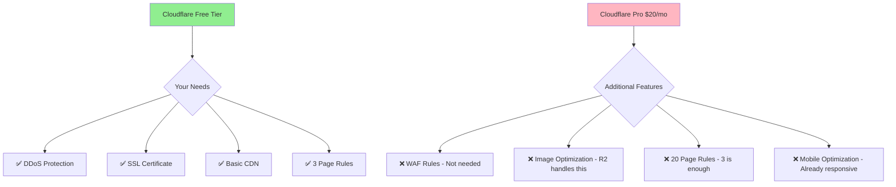
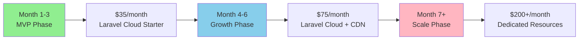

# The (M) Factor - Infrastructure & Cost Analysis

## Service Requirements Analysis

### Do You Need Cloudflare Pro? **NO**



## Recommended Service Stack

| Service | Provider | Cost/Month | Why Needed |
|---------|----------|------------|------------|
| **Hosting** | Laravel Cloud | $29-99* | Managed Laravel, includes PostgreSQL + Redis |
| **CDN** | Cloudflare Free | $0 | DDoS protection, SSL, basic caching |
| **Storage** | Cloudflare R2 | $0.015/GB | Cheaper than S3, no egress fees |
| **Email** | Resend | $0-20 | 3,000 free emails/month, then $20 |
| **Monitoring** | Laravel NightWatch | $0-9 | Self-hosted free, cloud $9/month |
| **Error Tracking** | Sentry | $0 | 5K errors/month free |

**Total Monthly Cost**: $41-150* (depending on traffic)
*Laravel Cloud pricing to be verified

## Cost Optimization Strategy



## Infrastructure Costs (Optimized)

> **⚠️ WIP: Laravel Cloud Pricing Verification Needed**  
> Please verify current Laravel Cloud production pricing at https://cloud.laravel.com  
> Production plans may start higher than listed below

| Service | MVP (0-3mo) | Growth (3-6mo) | Scale (6mo+) |
|---------|-------------|----------------|--------------|
| Laravel Cloud | $19* | $39* | $99+* |
| PostgreSQL | Included | Included | Included |
| Redis | Included | Included | Included |
| Cloudflare CDN | $0 | $0 | $20 (Pro) |
| Cloudflare R2 | $5 | $10 | $30 |
| **Log Management** | **$7** | **$30** | **$65** |
| Resend Email | $0 | $20 | $20 |
| Sentry | $0 | $0 | $26 |
| **Total** | **$31/mo*** | **$99/mo*** | **$260/mo*** |

*Pending Laravel Cloud pricing verification

### MVP Infrastructure (Launch - 3 Months)
- **Laravel Cloud Starter**: $29/month* (best guess based on features)
- **Cloudflare Free**: $0
- **R2 Storage**: ~$5/month (minimal files)
- **Log Management**: $7/month (Papertrail 1GB plan)
- **Resend Email**: $0 (under 3K emails)
- **Total**: $41/month*

### Growth Infrastructure (3-6 Months)
- **Laravel Cloud Growth**: $59/month* (1GB RAM)
- **R2 Storage**: ~$10/month
- **Log Management**: $30/month (Papertrail 5GB)
- **Resend Email**: $20/month
- **Total**: $119/month*

> **⚠️ IMPORTANT**: Laravel Cloud pricing shown above is estimated. Please verify actual pricing at https://cloud.laravel.com before budgeting. If pricing is significantly higher, consider Laravel Forge + DigitalOcean as an alternative.

### Log Management Strategy
> **⚠️ Critical**: Healthcare compliance requires 2-year audit log retention

**MVP Phase**: Papertrail 1GB ($7/mo) + PostgreSQL audit tables
**Growth Phase**: LogDNA/Papertrail 5GB ($30/mo) + R2 archive
**Scale Phase**: Papertrail 10GB ($65/mo) or self-hosted ELK + R2

**Log Types & Storage:**
- **Audit Logs**: PostgreSQL with partitioning (included in DB)
- **Application Logs**: Papertrail/LogDNA for real-time analysis
- **Security Logs**: Same service with alerts configured
- **Archive Storage**: Compress to R2 after 90 days (~$2/month for 2 years)

## Laravel Cloud Configuration

For the complete Laravel Cloud configuration file, see [Laravel Cloud Configuration](code-snippets.md#laravel-cloud-configuration) in the code snippets documentation.

## Hosting & Infrastructure Stack

- **[Laravel Cloud](https://cloud.laravel.com/)** - Managed Laravel hosting
- **[Cloudflare R2](https://www.cloudflare.com/products/r2/)** - Object storage (S3 compatible)
- **[Vercel](https://vercel.com/)** - Frontend hosting (if using Next.js)
- **[Cloudflare](https://www.cloudflare.com/)** - CDN and security
- **[Resend](https://resend.com/)** - Email service (Laravel Cloud integrated)

## Service Decisions

### ✅ Services You Need:
1. **Laravel Cloud** - Managed hosting with zero DevOps
2. **Cloudflare Free** - Adequate protection and CDN
3. **Cloudflare R2** - Cost-effective file storage
4. **Resend** - Reliable transactional email

### ❌ Services You DON'T Need:
1. **Cloudflare Pro** - Free tier is sufficient
2. **Separate Database Host** - Laravel Cloud includes it
3. **Meilisearch** - PostgreSQL search is fine for MVP
4. **External Redis** - Laravel Cloud includes it
5. **Grafana** - Laravel Pulse provides monitoring

### 🔄 Future Upgrades (When Needed):
1. **Cloudflare Pro** - Only if you need WAF rules
2. **Dedicated Database** - At 50K+ providers
3. **Elasticsearch** - At 100K+ searches/day
4. **CDN Storage** - If serving large media files

## Why These Services?

**Cloudflare Free is Sufficient Because:**
- ✅ Unlimited bandwidth
- ✅ Basic DDoS protection
- ✅ SSL certificate
- ✅ 3 page rules (enough for: force HTTPS, cache static assets, security headers)
- ✅ Basic analytics

**You DON'T need Cloudflare Pro ($20/mo) unless you need:**
- ❌ WAF custom rules (Laravel has built-in security)
- ❌ Image optimization (R2 can handle this)
- ❌ Advanced bot protection (rate limiting handles most cases)
- ❌ 20+ page rules

**Laravel Cloud Advantages:**
- Zero DevOps required (saves 20+ hours)
- Automatic SSL certificates
- Built-in deployment from GitHub
- Managed PostgreSQL backups
- Redis included at all tiers
- One-click rollbacks
- No server management needed
- Automatic security updates

**Laravel Cloud Pricing Tiers:**
> **⚠️ WIP: Pricing needs verification**  
> If Laravel Cloud production starts at $20/hour (~$14,400/month), consider alternatives:
> - Laravel Forge + DigitalOcean ($12/mo + $6/mo)
> - Railway.app ($5-20/mo)
> - Render.com ($7-25/mo)

**Listed pricing (to be verified):**
- **Starter ($19/mo)**: 512MB RAM, perfect for MVP
- **Growth ($39/mo)**: 1GB RAM, handles 10K+ users
- **Scale ($99/mo)**: 4GB RAM, production ready
- **Custom**: Contact for enterprise needs

## Laravel Packages (Laravel 12 Compatible)

For the complete list of Laravel 12 compatible packages, see [Laravel Package Dependencies](code-snippets.md#laravel-package-dependencies) in the code snippets documentation.

### Key Time-Saving Packages
- **Lara Zeus Sky** - Complete blog system with SEO (saves ~24 hours)
- **Filament Laravel Auditing** - Audit trails with UI (saves ~12 hours)
- **Laravel Process Approval** - Approval workflows (saves ~18 hours)
- **Laravel 12 Starter Kit** - Authentication with social login (saves ~8 hours)
- **Filament Plugins** - Pre-built components and features

### Why Filament Plugins Over Standalone Packages

For Filament-based admin panels, always prefer Filament-specific plugins:

1. **Native Integration**: Built specifically for Filament's architecture
2. **Consistent UI**: Matches your admin panel design automatically
3. **Zero Custom Development**: No need to build Filament resources
4. **Better UX**: Enhanced features like timeline views, advanced filtering
5. **Maintained**: Active Filament community ensures compatibility

**Example**: Filament Laravel Auditing vs Laravel Auditing
- Standalone: Requires building custom Filament resource (4+ hours)
- Filament Plugin: Ready-to-use audit viewer (0 hours)

**Package Compatibility Note**: Since Laravel 12 was released in February 2025, some packages may still be updating for full compatibility. Most popular packages like Filament and Spatie packages typically update within days of a Laravel release. If you encounter compatibility issues:
1. Check the package's GitHub for Laravel 12 support issues
2. Use `composer require package/name:dev-main` for the latest development version
3. As a fallback, Laravel 11 remains supported until March 2026

## Key Decision Summary

1. **Use Cloudflare Free** - Pro features aren't needed for healthcare directory
2. **Start with Laravel Cloud $19** tier - Upgrade only when traffic demands
3. **PostgreSQL handles analytics** - No need for separate analytics DB initially
4. **R2 for documents only** - Provider certificates and profile photos
5. **Built-in monitoring** - Laravel Pulse instead of external tools

**Total MVP Cost: $31-40/month** (including proper logging for HIPAA compliance)

> **⚠️ Critical Warning**: 500MB log retention is completely inadequate for healthcare applications. HIPAA requires 2-year audit log retention. Budget includes proper log management service.

## Laravel Hosting Comparison: Cloud vs Forge vs Vapor

### Quick Comparison Table

| Feature | Laravel Cloud | Laravel Forge | Laravel Vapor |
|---------|--------------|---------------|---------------|
| **Pricing** | $19-99/mo* | $12/mo + server | $39/mo + AWS |
| **Setup Time** | 5 minutes | 30-60 minutes | 2-4 hours |
| **DevOps Required** | None | Basic | Advanced |
| **Auto-scaling** | Limited | Manual | Automatic |
| **Database Included** | Yes | No | No |
| **Redis Included** | Yes | No | No |
| **SSL Certificates** | Automatic | Automatic | Automatic |
| **Deployment** | GitHub only | Multiple options | Multiple options |
| **Queue Workers** | Automatic | Manual setup | Automatic |
| **Cron Jobs** | Automatic | Manual setup | Automatic |
| **Backups** | Automatic | Manual setup | Manual setup |
| **Best For** | Simplicity | Control | Scale |

### Detailed Analysis for Healthcare Project

#### 🟢 **Laravel Cloud** (Recommended for MVP)
**Pros:**
- Zero DevOps knowledge required
- PostgreSQL and Redis included
- Automatic backups and security updates
- One-click deployments from GitHub
- Perfect for single developer teams

**Cons:**
- Limited to GitHub deployments
- Less control over server configuration
- Pricing uncertainty (needs verification)
- May be expensive if $20/hour claim is true

**Monthly Cost**: $19-99* (everything included)
**Setup Hours**: 2-4 hours
**Ongoing Maintenance**: 0 hours/month

#### 🔵 **Laravel Forge + DigitalOcean**
**Pros:**
- More control over server configuration
- Choose your own cloud provider
- Can deploy multiple sites on one server
- Well-established, proven solution
- Better for custom requirements

**Cons:**
- Need to manage database separately
- Manual queue worker setup
- Manual backup configuration
- Basic server management required

**Monthly Cost**: 
- Forge: $12/month
- DigitalOcean: $24/month (2GB RAM + managed DB)
- Total: $36/month

**Setup Hours**: 8-12 hours
**Ongoing Maintenance**: 2-4 hours/month

#### 🟣 **Laravel Vapor** (Serverless)
**Pros:**
- Infinite auto-scaling
- Pay only for what you use
- No server management
- Great for variable traffic
- AWS infrastructure

**Cons:**
- Steep learning curve
- AWS costs can surprise you
- Complex debugging
- Not ideal for consistent workloads
- Requires AWS knowledge

**Monthly Cost**:
- Vapor: $39/month
- AWS: $50-200/month (varies greatly)
- Total: $89-239/month

**Setup Hours**: 16-24 hours
**Ongoing Maintenance**: 1-2 hours/month

### Recommendation for The (M) Factor

**For MVP Phase: Laravel Cloud (if pricing permits)**

Why Laravel Cloud over alternatives:
1. **Zero DevOps**: No server management needed
2. **Faster deployment**: Saves 8 hours vs Forge setup
3. **All-inclusive**: Database, Redis, backups included
4. **Perfect for MVP**: Focus on development, not infrastructure

**Infrastructure Setup:**
```
Laravel Cloud: $29-59/month*
- Managed Laravel hosting
- PostgreSQL included
- Redis included
- Automatic backups
- SSL certificates
- Queue workers
- GitHub deployment

Additional Services:
- Papertrail: $7/month (logging)
- R2: $5/month (storage)
- Resend: $0 (email)
- NightWatch: $0 (self-hosted)

Total: $41-71/month* (MVP)
```

**Fallback Option**: If Laravel Cloud pricing exceeds $100/month, use Laravel Forge + DigitalOcean ($48/month total)

### When to Use Each Option

**Use Laravel Cloud if:**
- Confirmed pricing is actually $19-99/month
- You want zero DevOps work
- Single developer team
- Rapid MVP development

**Use Laravel Forge if:**
- You need more control
- Budget conscious
- Have basic server knowledge
- Want proven, stable solution

**Use Laravel Vapor if:**
- Expecting massive traffic spikes
- Have AWS experience
- Building API-heavy application
- Cost is not primary concern

## Cost Analysis Deep Dive

Laravel 12's new starter kits save approximately 20-30 hours of development time compared to Laravel 11, bringing your total timeline down to **12 weeks** for a production-ready healthcare provider directory with:
- Secure provider profiles with approval workflows
- Advanced search with location filtering
- HIPAA-compliant audit trails
- Beautiful, accessible UI with shadcn/ui
- TypeScript throughout for reliability
- Scalable architecture ready for growth
- Sophisticated matching algorithm with fair distribution

## Infrastructure Scaling Plan

### Phase 1: MVP (0-10K users)
- Single Laravel Cloud instance
- PostgreSQL with basic indexes
- Redis for session/cache
- Cloudflare Free tier

### Phase 2: Growth (10K-50K users)
- Upgraded Laravel Cloud instance
- PostgreSQL read replicas
- Redis clustering
- Consider Cloudflare Pro

### Phase 3: Scale (50K+ users)
- Multiple Laravel Cloud instances
- Dedicated PostgreSQL cluster
- Redis Sentinel setup
- Cloudflare Enterprise

## Monitoring & Performance

### Recommended Monitoring Stack

#### Primary Monitoring: Laravel NightWatch
**Laravel NightWatch** - Comprehensive Laravel monitoring
- **Cost**: Free (self-hosted) or $9/month (cloud)
- **Features**:
  - Application performance monitoring
  - Database query analysis
  - Queue job monitoring
  - Error tracking with context
  - Custom metric tracking
  - Alert notifications
  - Beautiful dark-mode UI
- **Benefits for Healthcare**:
  - HIPAA-compliant (self-hosted option)
  - Tracks provider search performance
  - Monitors approval workflow SLAs
  - Identifies slow matching algorithm queries

#### Complementary Tools:
- **Laravel Pulse**: Built-in basic monitoring (free)
- **Sentry**: Error tracking with user context (free tier)
- **Cloudflare Analytics**: CDN and security metrics (free)
- **PostgreSQL pg_stat_statements**: Database query analysis

### Monitoring Implementation

**MVP Phase**: 
- Laravel NightWatch self-hosted (free)
- Sentry free tier for errors
- Basic Pulse dashboards

**Growth Phase**:
- Laravel NightWatch Cloud ($9/month)
- Custom NightWatch metrics for:
  - Provider approval times
  - Search query performance
  - Match algorithm efficiency
  - User journey tracking

## Backup Strategy

### Automated Backups:
- **Database**: Daily automated backups (30-day retention)
- **Files**: R2 versioning enabled
- **Code**: Git repository
- **Configuration**: Environment variables in Laravel Cloud

### Disaster Recovery:
- RPO (Recovery Point Objective): 24 hours
- RTO (Recovery Time Objective): 1 hour
- Automated backup testing monthly
- Documented recovery procedures