# The (M) Factor - Infrastructure & Cost Analysis

## Service Requirements Analysis

### Do You Need Cloudflare Pro? **NO**

```mermaid
graph TD
    A[Cloudflare Free Tier] --> B{Your Needs}
    B --> C[✅ DDoS Protection]
    B --> D[✅ SSL Certificate]
    B --> E[✅ Basic CDN]
    B --> F[✅ 3 Page Rules]
    
    G[Cloudflare Pro $20/mo] --> H{Additional Features}
    H --> I[❌ WAF Rules - Not needed]
    H --> J[❌ Image Optimization - R2 handles this]
    H --> K[❌ 20 Page Rules - 3 is enough]
    H --> L[❌ Mobile Optimization - Already responsive]
    
    style A fill:#90EE90
    style G fill:#FFB6C1
```

## Recommended Service Stack

| Service | Provider | Cost/Month | Why Needed |
|---------|----------|------------|------------|
| **Hosting** | Laravel Cloud | $19-39 | Managed Laravel, includes PostgreSQL + Redis |
| **CDN** | Cloudflare Free | $0 | DDoS protection, SSL, basic caching |
| **Storage** | Cloudflare R2 | $0.015/GB | Cheaper than S3, no egress fees |
| **Email** | Resend | $0-20 | 3,000 free emails/month, then $20 |
| **Monitoring** | Laravel Pulse | $0 | Built into Laravel 12 |
| **Error Tracking** | Sentry | $0 | 5K errors/month free |

**Total Monthly Cost**: $35-75 (depending on traffic)

## Cost Optimization Strategy

## Infrastructure Costs (Optimized)

| Service | MVP (0-3mo) | Growth (3-6mo) | Scale (6mo+) |
|---------|-------------|----------------|--------------|
| Laravel Cloud | $19 | $39 | $99+ |
| PostgreSQL | Included | Included | Included |
| Redis | Included | Included | Included |
| Cloudflare CDN | $0 | $0 | $20 (Pro) |
| Cloudflare R2 | $5 | $10 | $30 |
| Resend Email | $0 | $20 | $20 |
| Sentry | $0 | $0 | $26 |
| **Total** | **$24/mo** | **$69/mo** | **$195/mo** |

### MVP Infrastructure (Launch - 3 Months)
- **Laravel Cloud Starter**: $19/month (512MB RAM)
- **Cloudflare Free**: $0
- **R2 Storage**: ~$5/month (minimal files)
- **Resend Email**: $0 (under 3K emails)
- **Total**: $24/month

### Growth Infrastructure (3-6 Months)
- **Laravel Cloud**: $39/month (1GB RAM)
- **R2 Storage**: ~$10/month
- **Resend Email**: $20/month
- **Total**: $69/month

## Laravel Cloud Configuration

For the complete Laravel Cloud configuration file, see [Laravel Cloud Configuration](code-snippets.md#laravel-cloud-configuration) in the code snippets documentation.

## Hosting & Infrastructure Stack

- **[Laravel Cloud](https://cloud.laravel.com/)** - Managed Laravel hosting
- **[Cloudflare R2](https://www.cloudflare.com/products/r2/)** - Object storage (S3 compatible)
- **[Vercel](https://vercel.com/)** - Frontend hosting (if using Next.js)
- **[Cloudflare](https://www.cloudflare.com/)** - CDN and security
- **[Resend](https://resend.com/)** - Email service (Laravel Cloud integrated)

## Service Decisions

### ✅ Services You Need:
1. **Laravel Cloud** - Managed hosting with zero DevOps
2. **Cloudflare Free** - Adequate protection and CDN
3. **Cloudflare R2** - Cost-effective file storage
4. **Resend** - Reliable transactional email

### ❌ Services You DON'T Need:
1. **Cloudflare Pro** - Free tier is sufficient
2. **Separate Database Host** - Laravel Cloud includes it
3. **Meilisearch** - PostgreSQL search is fine for MVP
4. **External Redis** - Laravel Cloud includes it
5. **Grafana** - Laravel Pulse provides monitoring

### 🔄 Future Upgrades (When Needed):
1. **Cloudflare Pro** - Only if you need WAF rules
2. **Dedicated Database** - At 50K+ providers
3. **Elasticsearch** - At 100K+ searches/day
4. **CDN Storage** - If serving large media files

## Why These Services?

**Cloudflare Free is Sufficient Because:**
- ✅ Unlimited bandwidth
- ✅ Basic DDoS protection
- ✅ SSL certificate
- ✅ 3 page rules (enough for: force HTTPS, cache static assets, security headers)
- ✅ Basic analytics

**You DON'T need Cloudflare Pro ($20/mo) unless you need:**
- ❌ WAF custom rules (Laravel has built-in security)
- ❌ Image optimization (R2 can handle this)
- ❌ Advanced bot protection (rate limiting handles most cases)
- ❌ 20+ page rules

**Laravel Cloud Advantages:**
- Zero DevOps required
- Automatic SSL certificates
- Built-in deployment from GitHub
- Managed PostgreSQL backups
- Redis included at all tiers
- One-click rollbacks

## Laravel Packages (Laravel 12 Compatible)

For the complete list of Laravel 12 compatible packages, see [Laravel Package Dependencies](code-snippets.md#laravel-package-dependencies) in the code snippets documentation.

**Package Compatibility Note**: Since Laravel 12 was released in February 2025, some packages may still be updating for full compatibility. Most popular packages like Filament and Spatie packages typically update within days of a Laravel release. If you encounter compatibility issues:
1. Check the package's GitHub for Laravel 12 support issues
2. Use `composer require package/name:dev-main` for the latest development version
3. As a fallback, Laravel 11 remains supported until March 2026

## Key Decision Summary

1. **Use Cloudflare Free** - Pro features aren't needed for healthcare directory
2. **Start with Laravel Cloud $19** tier - Upgrade only when traffic demands
3. **PostgreSQL handles analytics** - No need for separate analytics DB initially
4. **R2 for documents only** - Provider certificates and profile photos
5. **Built-in monitoring** - Laravel Pulse instead of external tools

**Total MVP Cost: $24-35/month** (vs. original $94/month estimate)

## Cost Analysis Deep Dive

Laravel 12's new starter kits save approximately 20-30 hours of development time compared to Laravel 11, bringing your total timeline down to **12 weeks** for a production-ready healthcare provider directory with:
- Secure provider profiles with approval workflows
- Advanced search with location filtering
- HIPAA-compliant audit trails
- Beautiful, accessible UI with shadcn/ui
- TypeScript throughout for reliability
- Scalable architecture ready for growth
- Sophisticated matching algorithm with fair distribution

## Infrastructure Scaling Plan

### Phase 1: MVP (0-10K users)
- Single Laravel Cloud instance
- PostgreSQL with basic indexes
- Redis for session/cache
- Cloudflare Free tier

### Phase 2: Growth (10K-50K users)
- Upgraded Laravel Cloud instance
- PostgreSQL read replicas
- Redis clustering
- Consider Cloudflare Pro

### Phase 3: Scale (50K+ users)
- Multiple Laravel Cloud instances
- Dedicated PostgreSQL cluster
- Redis Sentinel setup
- Cloudflare Enterprise

## Monitoring & Performance

### Built-in with Laravel Cloud:
- Application metrics
- Database performance
- Queue monitoring
- Error tracking
- Deployment history

### Additional Free Tools:
- Laravel Pulse (built-in)
- Sentry (free tier)
- Cloudflare Analytics
- PostgreSQL pg_stat_statements

## Backup Strategy

### Automated Backups:
- **Database**: Daily automated backups (30-day retention)
- **Files**: R2 versioning enabled
- **Code**: Git repository
- **Configuration**: Environment variables in Laravel Cloud

### Disaster Recovery:
- RPO (Recovery Point Objective): 24 hours
- RTO (Recovery Time Objective): 1 hour
- Automated backup testing monthly
- Documented recovery procedures