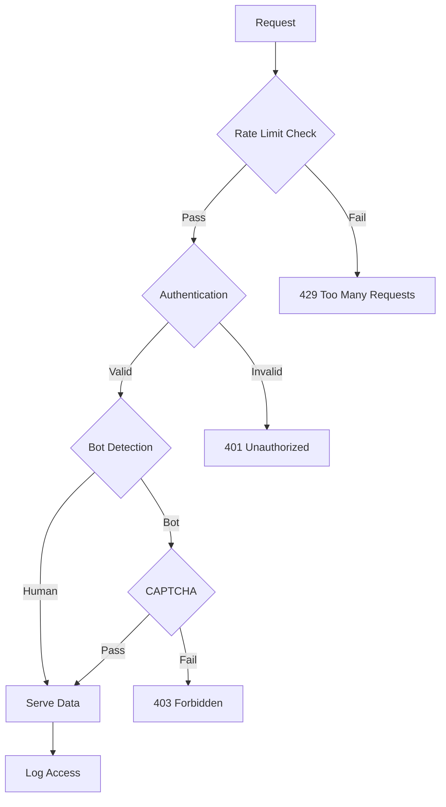
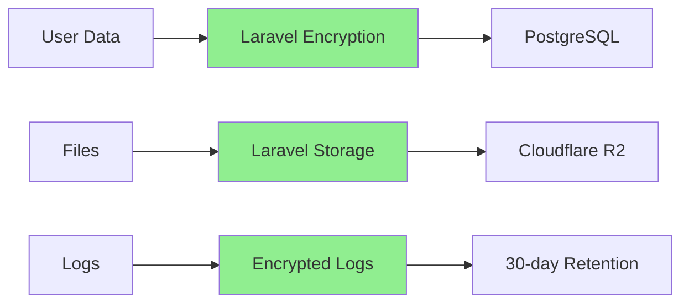
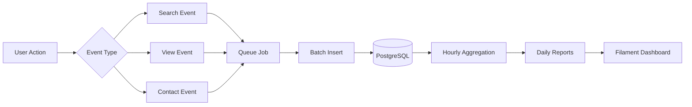
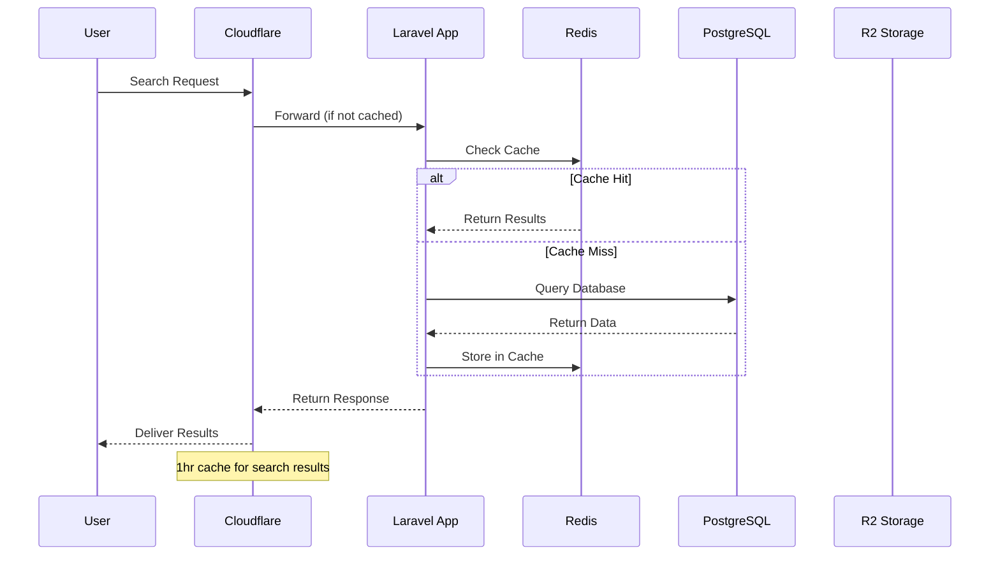

# The (M) Factor - Security & Analytics Implementation

## Security Implementation

### Anti-Crawling Protection

### Security Measures Implementation

**1. Rate Limiting (Laravel Built-in)**

Rate limiting is implemented using Laravel's built-in throttle middleware. See [Rate Limiting Configuration](code-snippets.md#rate-limiting-configuration) for implementation details.

**2. No Public Provider Listings**
- All provider data requires authentication
- No sitemap for provider pages
- No public provider URLs

**3. Progressive Data Loading**
- Maximum 20 results per page
- No bulk export endpoints
- Session-based result caching

**4. Cloudflare Security Features**
- Bot Fight Mode (Free tier)
- Challenge suspicious traffic
- Country-based restrictions if needed

### HIPAA Compliance Checklist

- [x] Encryption at rest (PostgreSQL)
- [x] Encryption in transit (SSL/TLS)
- [x] Audit logs for all data access
- [x] Role-based access control
- [x] Automatic session timeouts
- [x] Secure password requirements
- [x] Data retention policies
- [x] Business Associate Agreements (BAA)

### Data Protection Architecture

## Analytics Implementation Strategy

### Event Tracking Architecture

### Data Flow Architecture

### Analytics Tables (PostgreSQL)

The analytics system uses three main tables for tracking events and metrics. See [Analytics Tables Schema](code-snippets.md#analytics-tables-schema) for the complete database schema.

### Key Metrics to Track

**User Behavior**
- Search queries and filters used
- Search-to-contact conversion rate
- Most viewed providers
- User session duration
- Return visitor rate

**Provider Performance**
- Profile completion rate
- Approval turnaround time
- Search appearance rate
- Contact conversion rate

**System Health**
- Search response times
- API performance
- Error rates
- Queue processing times

### Implementation with Laravel 12

Event tracking is implemented using Laravel's event system with queued jobs for performance. See [Analytics Event Listener](code-snippets.md#analytics-event-listener) for the implementation example.

### Analytics Storage Strategy

#### MVP (0-10K users)
- PostgreSQL tables
- Daily aggregations
- 30-day retention
- Filament widgets

#### Growth (10K+ users)
- Dedicated analytics tables
- Hourly aggregations
- 90-day retention
- Advanced dashboards

## Security Best Practices

### Authentication & Authorization
1. **Multi-Factor Authentication**: Required for all admin users
2. **Role-Based Access Control**: Granular permissions
3. **Session Management**: 
   - 30-minute timeout for inactive sessions
   - Secure session cookies
   - Single session per user

### Data Security
1. **Encryption**:
   - All data encrypted at rest
   - TLS 1.3 for data in transit
   - Encrypted backups

2. **Access Control**:
   - Principle of least privilege
   - Regular access reviews
   - Audit trail for all data access

3. **Input Validation**:
   - Sanitize all user inputs
   - SQL injection prevention
   - XSS protection

### Infrastructure Security
1. **Network Security**:
   - Cloudflare DDoS protection
   - Rate limiting on all endpoints
   - IP whitelisting for admin access

2. **Application Security**:
   - Regular security updates
   - Dependency scanning
   - Code security reviews

3. **Monitoring**:
   - Real-time threat detection
   - Anomaly detection
   - Security incident logging

## Compliance Requirements

### Data Privacy
- **Data Minimization**: Only collect necessary data
- **User Consent**: Clear consent mechanisms
- **Data Portability**: Export user data on request
- **Right to Deletion**: Remove user data on request

### Audit Requirements
- **Access Logs**: Who accessed what and when
- **Change Logs**: Track all data modifications
- **Security Logs**: Failed login attempts, suspicious activity
- **Retention**: 2-year audit log retention

### Documentation
- **Security Policies**: Written and maintained
- **Incident Response Plan**: Documented procedures
- **Training Records**: Staff security training
- **Compliance Reports**: Regular compliance audits

## Security Checklist for Launch

### Pre-Launch Security Audit
- [ ] Penetration testing completed
- [ ] Vulnerability scanning passed
- [ ] Security headers configured
- [ ] SSL/TLS properly configured
- [ ] Rate limiting tested
- [ ] Authentication flows verified
- [ ] Authorization rules tested
- [ ] Input validation confirmed
- [ ] Error handling reviewed
- [ ] Logging configured

### Ongoing Security Measures
- [ ] Weekly security updates
- [ ] Monthly vulnerability scans
- [ ] Quarterly penetration tests
- [ ] Annual security audit
- [ ] Continuous monitoring
- [ ] Incident response drills
- [ ] Security training updates
- [ ] Compliance reviews

## Analytics Dashboard Features

### Real-Time Metrics
- Active users online
- Current search volume
- Provider availability
- System performance

### Daily Reports
- Search trends
- Popular providers
- Conversion rates
- User engagement

### Provider Analytics
- Profile views
- Contact requests
- Search appearances
- Conversion rates

### System Analytics
- Performance metrics
- Error rates
- Queue performance
- API usage

## Implementation Priority

### Phase 1: Core Security
- Authentication system
- Basic rate limiting
- SSL/TLS setup
- Basic audit logging

### Phase 2: Enhanced Security
- Advanced rate limiting
- Bot detection
- CAPTCHA integration
- Enhanced audit trails

### Phase 3: Analytics Foundation
- Event tracking
- Basic dashboards
- Daily aggregations
- Provider metrics

### Phase 4: Advanced Analytics
- Real-time dashboards
- A/B testing metrics
- Advanced reporting
- Predictive analytics